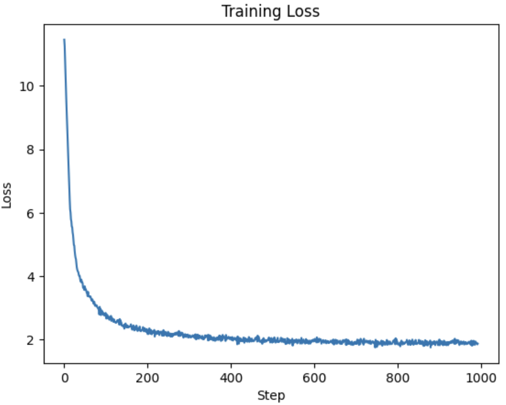

# MiniGPT — Building and Training an LLM from Scratch

A 20-million-parameter GPT-style language model built entirely from scratch using JAX and Flax, trained on the TinyStories dataset to generate short children's stories.

> **Sample output:**
> Prompt: `"Once upon a time a big bear"`
> Output: `"Once upon a time a big bear. All a little boy was three years old. He was very happy and wanted to play with his friends. He was very happy and he saw a big..."`

---

## Model Architecture

```
Input text  →  Tokenizer (GPT-2 BPE, vocab=50,257)
            →  Token Embedding  (50257 × 192)
             + Position Embedding (128 × 192)
            →  Transformer Block × 6
                  └─ Multi-Head Attention (6 heads, d_k=32)
                       └─ Q, K, V projections (192 → 32 per head)
                       └─ Scaled dot-product attention
                       └─ Causal mask (no peeking at future tokens)
                       └─ Weighted value aggregation
                  └─ Residual connection
            →  Output Linear Layer (192 → 50257)
            →  Next token prediction
```

| Hyperparameter | Value |
|---|---|
| Parameters | ~20 million |
| Vocabulary size | 50,257 (GPT-2 BPE) |
| Max sequence length | 128 tokens |
| Embedding dimension | 192 |
| Attention heads | 6 |
| Transformer blocks | 6 |
| Training data | TinyStories dataset |
| Framework | JAX + Flax NNX |

---

## Project Structure

```
.
├── Dockerfile                  # Docker image definition
├── docker-compose.yml          # Run Jupyter with one command
├── requirements.txt            # All Python dependencies
│
├── load/                       # Stage 1 — Data exploration
│   ├── data_loading.ipynb      # Load and explore TinyStories
│   ├── helper.py               # Data loading utilities
│   └── TinyStories-1000.txt    # Sample dataset (1000 stories)
│
├── build/                      # Stage 2 — Model architecture
│   ├── Building_and_training_LLM.ipynb   # Build the model step by step
│   └── helper.py               # Model class definitions
│
├── Train/                      # Stage 3 — Training
│   ├── train.ipynb             # Training loop, optimizer, loss
│   ├── helper.py               # Training utilities
│   ├── TinyStories-1000.txt    # Training data
│   └── training_loss.png       # Loss curve from full training run
│
└── Final/                      # Stage 4 — Inference
    ├── final.ipynb             # Load checkpoint, run Gradio demo
    └── helper.py               # Generation utilities (temperature, argmax)
```

**Run the notebooks in order:** `load` → `build` → `Train` → `Final`

---

## Run Locally with Docker

### Prerequisites
- [Docker Desktop](https://www.docker.com/products/docker-desktop/) installed and running

### Steps

```bash
# 1. Clone the repository
git clone https://github.com/<your-username>/building-and-training-llm.git
cd building-and-training-llm

# 2. Start Jupyter (builds the Docker image on first run)
docker-compose up

# 3. Open your browser
# Go to: http://localhost:8888
```

Open the notebooks in order and run all cells.

> **Note:** The trained model checkpoint is not included in this repo (143 MB — too large for GitHub).
> You need to train your own model. See the [Training on Google Colab](#training-on-google-colab-recommended) section below.

---

## Training on Google Colab (Recommended)

Training on CPU is extremely slow (~7 hours for 1000 stories). Use Google Colab's free T4 GPU instead (~5 minutes).

### Steps

**1. Open Google Colab:** [colab.research.google.com](https://colab.research.google.com)

**2. Set runtime to GPU:**
`Runtime → Change runtime type → T4 GPU → Save`

**3. Upload these two files** using the folder icon in the left sidebar:
- `Train/helper.py`
- `Train/TinyStories-1000.txt`

**4. Install dependencies:**
```python
!pip install flax optax grain tiktoken orbax-checkpoint -q
```

**5. Run training:**
```python
import os
os.environ["XLA_PYTHON_CLIENT_PREALLOCATE"] = "false"

import jax
import jax.numpy as jnp
import flax.nnx as nnx
import optax

from helper import MiniGPT, load_and_preprocess_data

num_epochs = 20

text_dl, batches_per_epoch = load_and_preprocess_data(
    file_path='TinyStories-1000.txt',
    batch_size=32,
    maxlen=128,
    max_stories=1000,
    num_epochs=num_epochs,
    shuffle=True,
    seed=42
)

model = MiniGPT()

def loss_fn(model, batch):
    inputs, targets = batch
    logits = model(inputs)
    loss = optax.softmax_cross_entropy_with_integer_labels(logits, targets).mean()
    return loss, logits

total_steps = batches_per_epoch * num_epochs
warmup_steps = max(1, total_steps // 10)

lr_schedule = optax.warmup_cosine_decay_schedule(
    init_value=0.0, peak_value=3e-4,
    warmup_steps=warmup_steps, decay_steps=total_steps, end_value=1e-5
)

optimizer = nnx.Optimizer(model, optax.adamw(learning_rate=lr_schedule, weight_decay=0.01), wrt=nnx.Param)
metrics = nnx.MultiMetric(loss=nnx.metrics.Average('loss'))

@nnx.jit
def train_step(model, optimizer, metrics, batch):
    grad_fn = nnx.value_and_grad(loss_fn, has_aux=True)
    (loss, logits), grads = grad_fn(model, batch)
    metrics.update(loss=loss, logits=logits, labels=batch[1])
    optimizer.update(model, grads)

prep_target_batch = jax.vmap(
    lambda tokens: jnp.concatenate((tokens[1:], jnp.array([0]))))

metrics_history = {'train_loss': []}

for epoch in range(num_epochs):
    step = 0
    for batch in text_dl:
        input_batch = jnp.array(jnp.array(batch).T).astype(jnp.int32)
        target_batch = prep_target_batch(jnp.array(jnp.array(batch).T)).astype(jnp.int32)
        train_step(model, optimizer, metrics, (input_batch, target_batch))
        if (step + 1) % 10 == 0:
            for metric, value in metrics.compute().items():
                metrics_history[f'train_{metric}'].append(value)
            metrics.reset()
            print(f"Epoch {epoch+1}, Step {step+1}, Loss: {metrics_history['train_loss'][-1]:.4f}")
        step += 1
```

**6. Save and download the checkpoint:**
```python
from pathlib import Path
import orbax.checkpoint

checkpoint_path = Path("/content/small_checkpoint.orbax").absolute()
checkpointer = orbax.checkpoint.PyTreeCheckpointer()
checkpointer.save(str(checkpoint_path), nnx.state(model), force=True)

from google.colab import files
import shutil
shutil.make_archive("/content/checkpoint", "zip", "/content/small_checkpoint.orbax")
files.download("/content/checkpoint.zip")
```

**7. Copy the checkpoint into Docker:**
```bash
# On your local Mac terminal:
unzip ~/Downloads/checkpoint.zip -d ~/Downloads/small_checkpoint.orbax
docker ps   # get container ID
docker cp ~/Downloads/small_checkpoint.orbax <container_id>:/app/Train/small_checkpoint.orbax
```

**8. Run `Final/final.ipynb`** — the Gradio interface will launch at `http://localhost:7860`

---

## Training Loss

The image below shows loss from a full training run on 2,000,000 stories:



---

## Tech Stack

| Library | Purpose |
|---|---|
| [JAX](https://github.com/google/jax) | Accelerated numerical computing |
| [Flax NNX](https://flax.readthedocs.io/) | Neural network layers |
| [Optax](https://optax.readthedocs.io/) | Optimizers (AdamW, cosine schedule) |
| [Grain](https://github.com/google/grain) | Efficient data loading |
| [tiktoken](https://github.com/openai/tiktoken) | GPT-2 BPE tokenizer |
| [Orbax](https://orbax.readthedocs.io/) | Model checkpointing |
| [Gradio](https://www.gradio.app/) | Interactive web demo |
| [Docker](https://www.docker.com/) | Reproducible environment |
